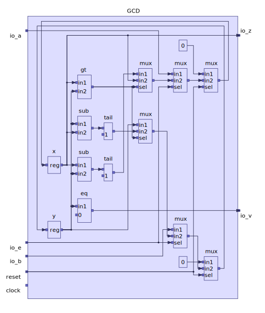

# Chisel / Firrtl to ELK Graph

This project can generate [ELK Graph](https://www.eclipse.org/elk/documentation/tooldevelopers/graphdatastructure.html) files, which can be layout by [ELK](https://www.eclipse.org/elk/) and rendered by [icviewer](https://github.com/easysoc/icviewer) as an interactive diagram to represent Chisel generated Firrtl circuits.

> If you want to see the ELK Graph directly, you can use [this](https://rtsys.informatik.uni-kiel.de/elklive/elkgraph.html) online service, it's open source https://github.com/kieler/elk-live . But there may be some bugs, which are not suitable for circuit diagrams.
>
> It is highly recommended to using the [IntelliJ plugin](https://plugins.jetbrains.com/plugin/16255-easysoc-diagrammer) to view your circuit. It supports interactive viewing of the sub-modules by double-click. In addition, it supports back navigation, zoom view, export SVG format and other functions.

The main idea is that the layout of graph use a [layer-based](https://www.eclipse.org/elk/reference/algorithms/org-eclipse-elk-layered.html) algorithm provided by the Eclipse Layout Kernel, and the graph rendering is implemented by [Sprotty](https://github.com/eclipse/sprotty) diagramming framework. The combination of the two gives us a very intuitive circuit schematics.

The logic of circuit format conversion comes from [diagrammer](https://github.com/freechipsproject/diagrammer) project and adapted to elk data generation with some optimizations.

## Example

**Purple Theme**
[View this example interactively](https://www.easysoc.org/icviewer/?graph=N4IgTgpgbglgzjA9gOxALgAwBoQBcCeADhOiAOZgCGhAFiDjACakXV04DGNMANo5KjQBtUHAg8IHXBGZoAZpR5ichRAlxJBoAB7oAjADYATADpsIfOgDMVswF8cCAF4k0oAO5NcdNFYDsemY4NBAwZDS46ACseqYAHDaJSTYALA54RK4gyIiMJAyy5FS0JgDiAMIAIvQgXLz8EIIieBDakWggFdWO4pLSsgpKECpqMBoo6Dr6fqbmlmgAtEaBGOnOrh5ePkZ+QSAhYRH6BvY4BMSkPJQARuI1TCzFNGVVJle3SgDEGCAOor1SGToQbKECqdSaSYgXSLKJ7eYGWxRNYwFxQzyMbzRPYHcLtOGrM6ZUiqMCRAqPNgvSomDg8RAcADWNTqfAE6Ga0japDpDOZPQkgIGilB4LGkLc0PQCxSJzm6DlKLRkoxWLQKQJwVCeOOpwyFw67zuFI6rBKXVp9KZbxu4jg31+AF0-iAxIL+sCRcMwaNxlopbD4egAJxw5GOVEbECqnya-bao5oAnpc5ZUnkkAPU1PakmSBiDOshpNUBc9rgCAFmpuvpA+RekYQiaSmEyuU4BF69borboDU4hPtQx61OXW08e6FM3PC35iC4G0fe0-OzOrD-d11kHesV+qGtuPzKyBcOuyM9zGxgeHfEj4kddOTynm15IAD6UEUAFcIHoWdw2UaDlS1act30-Hgfz-AVa2FIZG3FZspkWOJZg7BUu3PFVezQOIVi1G9dUJfUsiNCcTSKKkLXA79f0XO0HVXF0ayFT14J9Jt-QPINfAME4EmSQS-CVKMY2xcxcUTZMiQNH0ySfbMqNfRAP1oox-3qdlhBA7kOhoyCIHUmDWPrdjdwlZCFlQnjFQjZVNkvdA8OvHU0GHYjR0NccFMol8aX0n9TDI5cnWYgEPVM0VfQsgMFkPY5gxMPjkpSlLgxEi81TjSTbw8+85IzLNfJnZS33pShGBgZAyAANVouANMAksWl0zMVPKyrqrqgyGuMiLtwQvcW2lPR+3lNBbLPezoxw0aUhcxN3JTfKyJ86dc3fDqqtq+r6K+Fc1w3WC2Kizj92sAIeKMDATFPbtsMcpMFty5bZMfCj1uolTEC-XBCF+rpGuLYCWrA77fv+3BAb6rcGw4xCuIw8aFj0XZiPuhy1T0DA4meojXtI7yPpzL63x+v6AdeYLGMO11wthszoqQgN-Hwix0CMY8TAEwSkmEuzRJw7LB3EgmSUQeTiaU-zwYp3BuoeTgAOB7TQdId9ychhXmBhuDToR86JpszDprEtyjHbeNCLcybPJAVapb8kwNYh37tb2kKmPXOnNz1ncmcR9U0fQibJoxmbHqsG6JJF9Vo7FjocjyNaSdeXQlc0oDVbLUh05947Iv9s7hrcm6ohDpYVgyh61USmPraWmTCY+FPpZMbQPcY72c46SAyGrem-cGmKYXi82TcFx6djxm271kh3MynVOaQ76m-zC32TqLg2S7injUdu6vMavevXOkkjxclxfnxKlfndQDeC4G+GhuQqP992O6sOP8SCLPue0wS0KkvNuHdyahW9ixfqcNzLMxhCkYO7M0DXXmoYVK6D0oC0yj4d+p9EwpHjk3UgSd8jX0Uk7SwGcmogx7uzXWW9h5wP0GXCuywJ7YJDDPRuF8vIt0drfEw+BO4rm7qBUgfcB6b0LowwOY9YjsJrtsRBOV8ZEN4caMhxVcxCLXr8SBg8GEvxHtKORn8j4RyyjPc+dt3qaM+q8IRVU9FHRMs-WBgdcEhwPl-U2QsrEAMvsAm+2iTDgK9i46BjNi7IT0AfcaUdbC8yEuYs2Vg0JWzPrbfKJDW5OzILgN80FajKy0pyMRpoMxQIZvrV+AZEHzErgon+blcZ4KHFk+eRM7HLxMPkwpwjnH51cTAgOhs97xLhOgqZBg0hYMUb-DJUkAkPiAbkgRfTAhVSMsUzOzVaFbMkU-EZ0SAyWwaWGFJOFp5tNUTw+2XSir2JpBs++QVxye1plUoeRimGBnGnoOESTBJGEuY9YW1trH5VsY8npLyqpFKLKUnSYFkBFK+YY9xhszkmMPnM5p1y-6LQ6c3DRMK25wtRQM8JQzIk1OMb4dJ8wjAXLxRYk+hKXpqIKms3MLywmfIMdIn5gdYn1IVLjNB0y+L8ympPNUaSrHEuIbkUhZKnZwC-NcN82zEVZzKa1DV1xDnDKiTvZCphy5IMaejb+bKObKNjtwu2C81UCMNdqql+ipFuNGbvMeVhJlSpSrM2VHCno3PDQnbl-DczutMAcqhKt9Uou2eioVmKS7YsDD4uVSiuFKvUeRbpbc42vKpQK71xyzWxTkYCoFSQQWsrNuC-+eU3qrJjRaUt8KgZIrVnpVFxraXb1qTCLNe8c1hoJYs9pyz7l8OLeqzVHr4XlsfiaulvyFXjWZbi0N8zw0ctFly6FICl1atMPy9dw6ZGG1RnXEOCQkpBulaCtU10Z4ELnTkztrxcCUF4G+Kwva9XItIP+3gQ7qkjvpdHVhVcm04SsJbFRs820kqLa63MEGeBAc9RE6Dt6-X70Ifu5pLalnocCTyi0OG8M9uvYR4VYyx67ptb4sF-iqMrKvlh2jAHcO2ATTs6h2dykgDRYKn1Jyx08QnW+nwD6Z23OdQ8s9Ai6NCeQG8pcNNGPfIzeauDSDvEKYWahyF7bePqewwJvDV6vVHNNaO-QcSQ4pHkfWxIMrw6pPSRZgt2QVU0deO6lIIG9nicNVBgzvrzW3Xg00u1yCHUN0Cy6mzXbl3zWpiIgjsWZM4omc+l9MyzOHuU5Gk9HbF1uuy68iLNDxPCbTdJ6tsnkYsrI8l6dqGnUrTU8ErLWr5pbLXY5jdMHfnjK8XWrzaTysUc5Xc09Q3Qv1Z7Ymvt+zB30PTXF05cmuu+aual1y-XOkLr4+tkb99Ai5YgfljFB2YTbpDruydB6lvHpWzV67NIwuhN+o9mlTHDMBnvTxFI08eZAp87as2H6I1fu40F5Ov6aR0aiI1sTrUcMxee4VzAcm2HsdzdYFDjr0uDfIRpuzcIHv6cJ+1orXjSMnc4xGyzgDrNrcx-Tu7gzWtVpc389758OeWK53O1btPbOAbhMJ3VkXWqScrc5+l47jsI5wkpvr1OruZb-QLsbjOK1Oc3YHJHXizGIc50eqrv3edy-4wroHkRqXC4178owKO2cnElVK+HHH5X+djlEQLP7au5gALZfm0IUnHybSBx7zl7y3hsLWJbJ1Os7RK50Zb5yYVP-TGcTZvcx4j40v1+E++RrjUbZdaItCXwIUCk9gY6G6An+2ida73ZLvNEaLsYZCzSVvJgoHjae73lnYukEfcWw36rzvm+vAn0rkpoH+2Zm0z3trov+91563n2dqPC8u-X-H-ppv3l6fL2Dl7rOTM3WZUv6XqOm9POL9fzZu2RNJqd675q4W5TaBxH7la9ZU4F405r7j6-53bT6g4FZz5vYL7a4h7sqVbc7UYY4-4J6BAOYz4H70q+7GbzAeaJSw5JLB7k4MqKrfrBZ4El46pb4q7lip774i6kEJZWqk6QGn4qYDaG5F4sH4bIHM6i4zZII17H7NrL5O5BKX7wEJ6mDt5bbb60Ld57YkG-IQF27vqCFoZRoX5wH4EepT5m5M6z5SGsYYF0HfaO42J-ZG4qErp74aHsHqweESE2Ga5HYD465TxGEj5jgiHKHmHxraZIHp5gEsYkYmBv4GFYEWYy4uGiHX5REIpsFNatSba+G6HgEBFyGnb5owHhFmFiGrpWEP4oGi5oFMr2FhqOE4E8ZKGVGZHu4g6xFEYxJuYL4YAnDzZWAhqD7WBh4QqR5MHR4WgQAACOb4BgHeO+8xXB3ugcYqiw-ByR+grSDuoRhaY+Jg8xix4hPRlelk-qgapWoxQRUuDurR0aMxrwJxJwm+uyuR5YPwOh3BehxR5Weu0B5+sB3+rxZaNRxBvxgc0h8wAKJgwxC2OxFWqRn+6RERYJ+Ryunx3hIBk2vRh2nWgRmB9qZRwJFRoJCxbxlKEJBRUJhsDRHMTRX2Chzhq+FJpxRBtJ6x9JGAjKzCAepWtBYaaBAWjB6OzxbhwGnh2JHQnBPx3JJcWefBCG3WiOIRBupKrh5htgZekJCplxUON0te7+DxaRbJPSJetg6hAB22UWGi5x4OHWFcTJ+K6p5RmpGRCeVp4UMRUmdJVe4uRJDhLJUKaJHRXpDW0puOKaaxGema-xSJUBaW7pmGWplp4Jd+B01hhR8R-yr+JR9u2BZp7R3+6ZmJOR0ZOJsZcR8ZhJBZhhpJJhIJFp1+Wm92mZ3Rfp+pLMfJyCLpyWLRxZRx6ZnJDpT+vgvJUOegVB82QpB6Ip4eUx4p-25h4WUZyesp8e1Z+JMISpDS2xqppRw+GpqZnpb4OWHZ2Z-pBp1eRp9ZKR4eQ5zB1+801pWJlZXe9pXZcZyE+hh5wRjZXKphpZL5k+PpNJY5ROMJjJQZzRIZVmJZLZCeo2Ph75G5u+qa35NZv5CZ-5DZx5KZw5oFt+umWZtRkh9K0FpciR955mj5qJ5pbcJeKF2RHxH5wB25FxBJzpsFB6SZ52J5RFyFiBEFWFO54xV0-Z8hH+jeYZIFwlo5P0YAHAEAAAkmma2V0WcJQGAGQPOOpUXh3E4jgGAOTNtAAAqIBVS4ANSqyvZWBKawkjEmCB7TKYJvwpCOX6DOWuVTLuUsyeX7yzAuiva9nyKEhvy9lxC2TITQ48TRX2COjymgh2wyB6VHG-jryQJKUqUGURFgLA7aW6X6VakuxyzQzgBmXVSWXWW2XNAwjWTjQJURUBjBhRUxWtW9mcynBvx+BZrdWrBJVckpX5RpWqpam-jqTMQ5VqValCLgJFV6W4B5VmGA75GmW-QWVWXIA2UgwNVdW+4uWlb+UwjYwHWoLHUhXMK9kpDvy+WpT8x9E3V3UvrCRDXnGpWMDpV4G-hSk2nb6QVz5nVXSHX3WpSYJ3IABWX4yAUgkIP1egVgb4kNZFogM1K18l-SC1eAOlS1GNSF9GPhG1Gg1V21u1dl9qmxiNF1L6J1HMwYVNPll171YldyY1GVo0Qu6NE1lJWlONxVy1pVssWsigislVm1pNtVe1+gUQ80O6zlwxsyvV-VCts5q4yV3on131EpxxAKXNX4yls1Rem0iAFU203UP4vU-NeNGlwl1pxNW1UtFN8+sJMwR1tNV19B-ybtYNaUntDJ6ocQuM1BvMj1AYRgcQmxKQQd3Mat3su5kdUOiIZgIdyQYdu5DNSdtgOMXmb1GtXK7NCNSx65epP5PZH8pgvtyUENds0NsNe4RdyNqNro3NRe81hV1tJVZ5WRNQDtktO1dVyEjV72oNl18d11INNNQadNpcvZVgcQN0wx6dHMbGIc89i9cd5qq9MhCqUQqdfMntnMY8t1Fq+93m6tw1mto1X141Rev4fgyxgNouwN8SC98JcdUNMNcNEwCNfgTd3RrdERpa2N-6At+NbcmmguJlVVZANVA90tbkstPEwYApr1ntqMctIcKD7tQaedl9BdN9HNcQ+tht4DFCfNoDNtRe3aRNMDcD5N9VTk51ODUqM9L9I9U9rD6Dk5eZQx82StEO4V-u79XmaQLN6uI1skhdOtv4wYJDuVc1FDuNXdERFK2yfdsDZNg9AYw9C+o9Ht49s9k9LDbl3Dc9Hmt0GAVj1jNjVjBg6DQjSCIxJ4tjrjgxF9H1192tK5hk3x-1zUT99K7DTjFjUQbjtj9jXKdd39qAP110-9nugDZh7dGYlDKjZhGJ-+Gj9D2j+1xjVdfEbDjjTK+j09HjrNWtt96Jyw8jRtERYhIDyjgtZ5KF6jdDWjCDOwUdCCsdudh9md1ePTZ9594joBBD3jE1RgU12VBtCjxt7UptnUO0PUNQaTzT9Tml9t7TTtjDLt0wldY95qid3tBzBjRzVNgVHmZz4dAzXilzBT6UozeJbNhDcTwG01szdTZhAUv4qzTTZDAiZZWT2z8DztVFzlLVCdmxELh9xzXieguMwYBTy9yCtzJmCLJgSLaDTzFelTGVvutTALseoFjTYDijxl4tJNmjOzb8DlUOQzm9AVXl6oDLfThjIxzLnlM5bLW9UOwY3L9aKLUz+ThzAYcVO6pTXDOLTGeLcT2OHzpDWpgOpLVDERWOUDlLjtoLuzAKmDMhX6S96DfgerFBBrat0r3ysrMjFshLWpBVqT-zSry6Pd0DEt1L2rQ97VPVgjXrg1+dLzEzd9OwtrhlSjZLZ5f+bTbrOTCDuj8wzVntbV8VHVMISb-yTN1zu5Aa+8GbZTFrhiVrPjEdj9rNjpIYvrUa0TDd1rcQCT5FfhvyabXiubXDUTX91bRbtbkN68nyST3+9rfz4bqjBSf+RS2THTztcbTkKb5byb3rqbc9bCyLDji7gQy7+bQqhbkzcjJd+DXFC7PEaSa7aDbb9d8N1rwYCTvbnzRLFofKHdazt7V+qhYF7ovdILDDMSSD8SXMhrhjhgJr1gv7jLp1MyUOfguwwzNgQr29FBEHvTgrh9sHfYydOdiHhjR9WdKdfTG7z8W7d9UcJbEj2FEOYHP7gQf7n9Z7P9MjUcV7Crcz+VYbqrq1G2tD0bE7uzU7uEM7aATbSCCbhj-HFBYTlj4T1jkTT1UOonYT4ndj5TxH4zVTGTx4IbarAuKr6TmNURUbVLMbztKC9LkHIHHM2bgzxnOH-r+H6JaSan3zKkEEgUg7LHmNLF77HHNLNah7BgiUf75z3nvnJnyCcLO9p9PLNzUdu9UHeDnjUjrztH7zMzirRe97DrQ74Z-SWzHnHrEO37a9wH4XoHgHvgBX6HMSZHdziUVzZTGHZnlXJg1XUrVnXjynoJIxdn3+kDmn6zGXo77nennHRmxX2MtgpWBgMHciGAo3gpSHciGLWLuDh9dX6LiL67zXcXgbNn8rzozoQAA)

**Solid Theme(--flatten 2)**


## Using

### Install

**Maven**

https://search.maven.org/artifact/org.easysoc/layered-firrtl_2.12

for SBT

```
"org.easysoc" %% "layered-firrtl" % "1.0.8",
```

**Source**

```bash
git clone https://github.com/easysoc/layered-firrtl
cd layered-firrtl
```

### Creating graph from Chisel code

```scala
  val targetDir = "test_run_dir/gcd"
  (new ElkStage).execute(
    Array("-td", targetDir),
    Seq(ChiselGeneratorAnnotation(() => new GCD))
  )
```

### Creating graph from Firrtl file

To create a set of graphs of a Firrtl Circuit all you need is this project and a Firrtl file (typically a file 
generated by Chisel with a `.fir` extension). Let's say you have a Firrtl file `~/projects/output/circuit.fir`.
From the command line you while in this directory for this project

```bash
./elk.sh -i ~/projects/output/circuit.fir
```
or run through fat jar
```bash
sbt assembly
./utils/bin/elk -i ~/projects/output/circuit.fir
```
This will create a number of files in the `test_run_dir/${circuit.main}` directory that representing the firrtl circuit. Each file will be a ELK Graph for each module contained in the firrtl file.

## Options
* `-i`, set the source firrtl to work on
* `-td,--target-dir` work directory (default: "./test_run_dir")
* `--top`  the module in the hierarchy to start, default is the circuit top
* `--flatten` the maxDepth of the flatten levels
    * It is not recommended to exceed 2, otherwise the generated graph is too complicated
* `--lowFir` generate the corresponding lo.fir file
